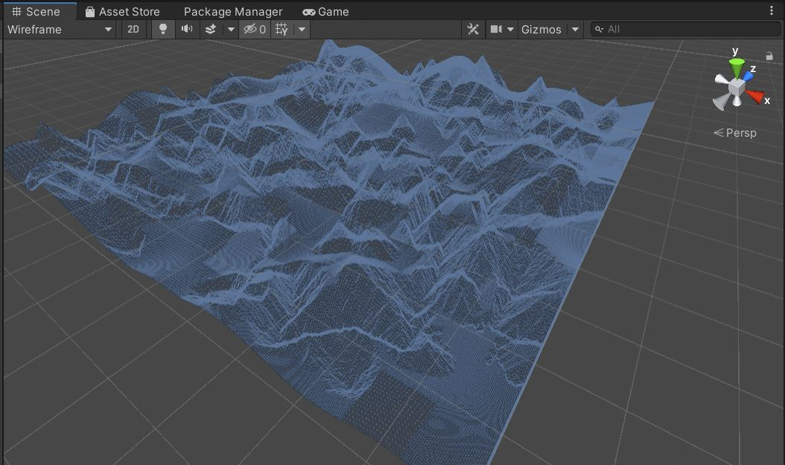

# Terrain Generation
Terrain Generation is an implementation of ***Procedural Content Generation*** for generating mountainous terrain. 
In this project, terrain with 5 different surface textures such as *sand, dirt, grass, rock and snow (from bottom to top)*
will be built uring [Perlin Noise](https://en.wikipedia.org/wiki/Perlin_noise#:~:text=Perlin%20noise%20is%20a%20procedural,details%20are%20the%20same%20size.).
Different textures will be connected seamlessly with the technique of Perlin noise and overlap method. Hence, a more realistic view of terrain will be produced.
To enrich the terrain layer, **mountain**, **hole** and **riverbank** have been created and its optional based on user's setting. 
Lastly, First Person Controller is added in this project to have a closer and better view on the generate terrain

#### Watch the demo!

 
Scene View.

First Person View

This project is build by using Unity.

## Features
* Splat Height - To add texture layers 
* Perlin Noise Settings - To create the terrain
* Mountain Settings - To add mountain in terrain
* Hole Settings - To add hole on the mountain in terrain
* River Settings - To add riverbank in terrain
* Rough Settings - To create rougher terrain surface
* Smooth Settings - To create smoother terrain surface
The features' settings outline can be referred [here](img/setting.JPG). Feel free to test on different value

## Methodology
This is a sample image of generated terrain

To create terrain, Perlin Noise will create a "random" number with its calculation to provide different height for different locations.
As you can see in the image below, the vertices will be plucked to the heights created.

## Experimental Results
Here is the sample image of the top view of terrain generated

Here is the sample image of the side view of terrain generated

## Future Improvement
- Add water in the river
- Create infinity terrain
